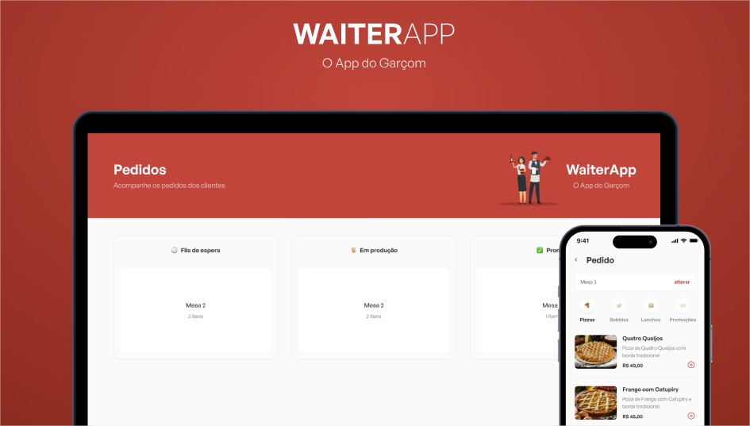

<h1 align="center"> WaiterApp WEB </h1>  

The project is a web application for waiters, where they can place orders, view the order status, see the total amount on the bill and send it to the kitchen.

## 💻 Features

A few of the things you can do with WaiterApp Web:

* Table order list
* Add order in progress
* Complete orders
* Finalize order
* Cancel orders
* Orders appear in realtime

## 🧰 Build Process

- Clone or download the repo
- `yarn` to install dependencies
- `yarn dev` to execute project

## 🚀 Technologies

- TypeScript
- React
- Styled-components
- Material UI
- Socket.IO
